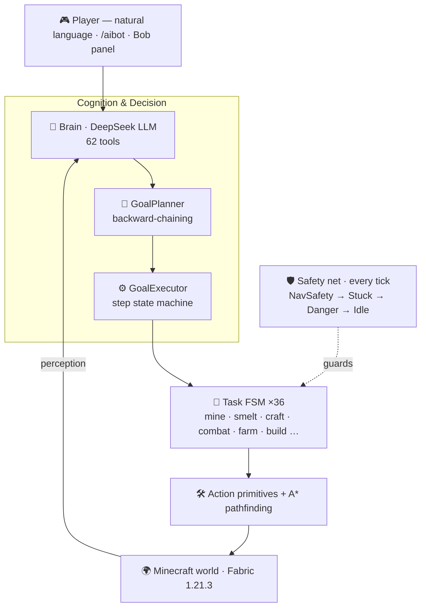

<p align="center">
  
</p>

<h1 align="center">AIBot</h1>

<p align="center">
  <b>An autonomous AI agent that plays Minecraft.</b><br>
  Tell <b>Bob</b> once, in plain language — he mines, builds, farms, fights, and survives on his own.<br>
  <sub><i>A real server-side Fabric mod — not a Python harness or a Mineflayer bot account.</i></sub>
</p>

<p align="center">
  <a href="LICENSE"></a>
  
  
  
  
  
</p>

<p align="center">
  <b>English</b>&nbsp;·&nbsp;<a href="README.zh-CN.md">简体中文</a>
</p>

---

> **LLM plans. Tasks execute. Bob survives.**
>
> AIBot spawns a real server-side player that perceives the world, back-chains your goal into a complete plan, and carries it out on its own — mining, fighting, farming, surviving.

## 🤖 What is AIBot?

**AIBot is an open-source, autonomous AI agent for Minecraft.** It's a server-side [Fabric](https://fabricmc.net/) mod for **Minecraft 1.21.3** in which a **large language model (LLM)** — DeepSeek by default, or any OpenAI-compatible model — drives a *real in-game player* that plays the game on its own.

Give it a goal in plain **English or Chinese** — *"mine 3 diamonds"*, *"build a house"*, *"get me some food"* — and AIBot perceives the world, plans the dependency-correct steps, and executes them autonomously: **mining, crafting, smelting, building, farming, breeding, fighting, fishing, trading, and surviving** on any randomly-generated, real-terrain world.

Unlike a hard-coded bot or a script, AIBot splits the brain in two: **the LLM decides *what* to do, and a deterministic engine reliably handles *how*.** It is not a client-side hack or cheat — it spawns a legitimate server-side fake player (in the Carpet-mod tradition) that obeys normal game rules.

> **Keywords:** Minecraft AI · autonomous agent · LLM agent · AI that plays Minecraft · Fabric mod · server-side bot · natural-language game AI · DeepSeek / GPT-style tool-calling agent.

## ✨ Why AIBot

Most "AI in games" demos either let a language model hallucinate raw actions, or hard-code a rigid script. AIBot does neither — it splits the brain in two:

- 🧠 **The LLM understands intent.** You say *"mine 3 diamonds"*; DeepSeek interprets it and picks from **62 tools**.
- ⚙️ **A deterministic engine guarantees execution.** A backward-chaining planner expands that goal into a dependency-correct plan, **36 self-contained task state machines** run it reliably, and a **five-layer safety net** keeps the bot alive.

The result is an agent that is **flexible enough to take orders in natural language, yet robust enough to actually finish the job.**

## 🧭 How AIBot is different

The LLM-in-Minecraft space has two well-known lines of work — AIBot takes a third path.

| | **Skill-learning agents** *([Voyager](https://github.com/MineDojo/Voyager))* | **Mineflayer bots** *([Mindcraft](https://github.com/mindcraft-bots/mindcraft))* | **AIBot** |
|---|---|---|---|
| **Runs as** | Python + Mineflayer + a MC instance | Node.js + Mineflayer | **a drop-in server-side Fabric mod** |
| **The player is** | a Mineflayer client that logs in | a Mineflayer client that logs in | **a real, server-spawned player** (Carpet-style fake player) |
| **The LLM…** | writes & self-debugs JavaScript | can write / run JavaScript | **only plans** — emits goals & tool calls, never in the execution loop |
| **Execution** | LLM-generated programs | LLM-generated programs | **deterministic task state machines** |
| **Default model** | GPT-4 | multi-provider | **DeepSeek** · any OpenAI-compatible |

These are different bets, not better-or-worse. Voyager pioneered open-ended **skill discovery**; Mindcraft explores **multi-agent** social play — things AIBot deliberately doesn't chase. AIBot optimizes for the opposite: **take a goal in plain language and finish it reliably**, because the model never touches the execution loop and every task carries its own watchdog and safety net.

## 🎬 See it in action

```
say in chat Bob mine 3 diamonds
```

AIBot back-chains the goal into a full plan and executes it step by step:

```
chop oak → crafting table → wooden pickaxe → mine stone → stone pickaxe
→ descend to Y16 → mine iron → smelt → iron pickaxe → gear up
→ staircase down to Y-59 → ⛏  mine diamonds  ✓
```

You never hand it a step list. If a step fails, it **re-plans**. If it's drowning or under attack, it **bails out and survives**.

## 📏 Measured, not marketing

Most "AI plays Minecraft" projects show one lucky highlight reel. AIBot ships with a **reliability harness** (`/aibot verify`) that runs each goal across **many randomly-generated survival worlds** and reports real, multi-seed success rates — so capabilities are *earned*, not cherry-picked.

- ✅ **Reliable today** — the full food chain (self-sufficiency **measured from 2 → 8 out of 10** across random seeds), iron gear & smelting, base-building by day, and ore mining across a battery of geometry stress-tests (pockets, walls, overhangs, deep veins, flooded shafts).
- 🚧 **Honest about the hard parts** — deep diamond runs and 100-block bulk hauls on *arbitrary* random terrain are still climbing. You'll find them on the **roadmap** below — not dressed up as done.

## 🧩 Features

| | |
|---|---|
| 🗣️ **Natural-language control** | Plain English / Chinese commands, understood by a DeepSeek LLM wired to 62 tools. |
| 🎯 **Goal back-chaining** | One goal → a dependency-correct multi-step plan. No manual breakdown. |
| 🧩 **LLM + deterministic hybrid** | The model reasons; the engine executes. Flexible *and* reliable. |
| 🎒 **9 one-shot goals** | Diamonds, a full iron armor set + sword, a house, a base (table/furnace/chest), cooked food, crops→bread, ore, item stockpiles — each from one command. |
| 🍞 **Five food paths** | Hunt→cook, farm wheat→bread (waits for crops to grow), forage berries, infinite-water irrigation, cake, raid village fields — auto-picked by what's nearby. |
| 🛡️ **Unified survival layer** | Drowning, lava, suffocation, stuck, threats, dark-traps — handled every tick; digs shafts that seal out flooding water. |
| 🧍 **Human-like behavior** | Staircase mining (never straight down), no teleporting, no bunny-hopping. |
| ⛏️ **Full survival loop** | Mine, smelt, craft, fight, hunt, farm, breed, build, fish, trade, sleep, gear up. |
| 🔭 **Ore & tree prospecting** | Palette-level long-range scan locates resources and paths to them. |
| 🌍 **Verified on real terrain** | A multi-seed reliability harness (`/aibot verify`) proves goals on randomly-generated worlds — not just flat test arenas. |
| 🖥️ **Client control panel** | `Alt + 0` opens Bob's panel: health, hunger, task, tokens, inventory, chat. |

## 🏗️ Architecture

> **One principle: the LLM plans, deterministic tasks execute.**



<p align="center"><sub><b>164</b> classes · <b>30K</b> LOC · <b>62</b> tools · <b>36</b> task state machines · <b>9</b> goal types · <b>5</b>-layer safety net</sub></p>

## 🚀 Quick Start

### Requirements

| Component | Version |
|---|---|
| Minecraft | `1.21.3` |
| Fabric Loader | `0.18.4+` |
| Fabric API | `0.114.1+1.21.3` |
| Yarn Mappings | `1.21.3+build.2` |
| Java | `21` |

### Build & run

```bash
git clone https://github.com/zoyluoblue/mc_aiplayer.git
cd mc_aiplayer

./gradlew build        # build the mod
./gradlew runServer    # dev server
./gradlew runClient    # dev client
```

### Configure the LLM

Provide your DeepSeek API key via environment variable (recommended):

```bash
export DEEPSEEK_API_KEY="sk-your-key"
```

On first run the mod writes `aibot.json` to the Fabric config directory. You can also set the key, base URL and model there:

```json
{
  "deepseek": { "baseUrl": "https://api.deepseek.com", "model": "deepseek-chat" }
}
```

> Any OpenAI-compatible endpoint works — just point `baseUrl` at your provider.

## 🎮 Usage

```mcfunction
/aibot spawn Bob                              # spawn an AI player
/aibot list                                   # list active bots
/aibot brain say Bob mine 3 diamonds          # natural-language goal
/aibot task assign Bob mine minecraft:stone 16
/aibot task status Bob                         # inspect / abort a task
/aibot brain status Bob
```

Press **`Alt + 0`** in-game to open the **Bob control panel** — track health, hunger, task, brain state, token usage and inventory, and send natural-language messages directly.

## 🧠 How it works

| Layer | Package | Role |
|---|---|---|
| **Brain** | `brain` | DeepSeek tool-calling loop; turns intent into goals & actions |
| **Goal engine** | `goal` | `Goal` → `GoalPlanner` (back-chaining) → `GoalExecutor` (FSM) |
| **Tasks** | `task` | 36 self-contained state machines, each with its own watchdog |
| **Action / Pathfinding** | `action` · `pathfinding` | `BlockMiner`, `DigNav`, `ActionPack`; A* with stand-ability checks |
| **Knowledge** | `craft` · `mining` | recipes, mining/smelt chains, tool tiers, ore & tree prospector |
| **Safety net** | `task` · `coordination` | `BotTickCoordinator`: NavSafety → Stuck → Danger → Goal → Idle |
| **Entity** | `entity` | `AIPlayerEntity` — a real server-side fake player |

## 📦 Project structure

```text
src/main/java/io/github/zoyluo/aibot
├── action/        # low-level: move, mine, interact, inventory, build
├── brain/         # LLM requests, tool registry, decision coordination
├── command/       # /aibot commands
├── coordination/  # multi-bot task board & idle coordination
├── craft/         # recipes & crafting helpers
├── entity/        # the AI player entity
├── goal/          # declarative goals, planner, executor
├── mining/        # ore scan & long-range prospector
├── pathfinding/   # A* pathfinding & danger checks
├── task/          # deterministic task state machines + safety net
└── …              # log · memory · network · observe · persist · mixin
```

## 🛠️ Tech stack

**Java 21** · **Fabric** (Loader 0.18.4, API 0.114.1+1.21.3) · **Yarn** 1.21.3+build.2 · **Gradle** · **DeepSeek** (OpenAI-compatible API).

## 🗺️ Roadmap

- [x] Zero-to-hero goals — food (5 paths), full iron armor + sword, house, base, stockpiles
- [x] Real-terrain reliability harness — `/aibot verify` · multi-seed success-rate measurement
- [x] Unified survival layer — drowning / lava / fire / threats + corpse recovery; shaft-flood sealing
- [ ] Natural-language commander hardening — intent→tool wiring regression (`tool_dispatch`), long-range navigation
- [ ] Reliable deep diamond mining on random terrain
- [ ] Obsidian via water-on-lava (≥15)
- [ ] House completion under night mobs (shed-first / build-by-day)
- [ ] Multi-bot collaboration · long-term memory recall

## ❓ FAQ

**Can an AI play Minecraft on its own?**
Yes. AIBot is an autonomous AI agent that plays Minecraft without human input — you give one natural-language goal and it mines, builds, farms, fights, and survives by itself on real-terrain worlds.

**How does a large language model (LLM) control a Minecraft bot?**
The LLM only decides *intent* — it emits tool calls like `mine_ore` or `build_house` from a 62-tool API. A deterministic engine then back-chains the goal into a dependency-correct plan and runs it with 36 self-contained task state machines, so the bot is flexible enough to take orders yet reliable enough to finish them.

**Is AIBot a hack, cheat, or client mod?**
No. AIBot is a **server-side** Fabric mod that spawns a legitimate fake player (in the Carpet-mod tradition) and plays by normal game rules. There is no client-side injection or x-ray.

**Which LLMs / AI models does it support?**
DeepSeek out of the box, and **any OpenAI-compatible endpoint** (GPT-style chat + tool-calling) — just point the `baseUrl` at your provider in `aibot.json`.

**What Minecraft version and mod loader does it need?**
Minecraft **1.21.3** on **Fabric** (Loader 0.18.4+, Fabric API 0.114.1+1.21.3), Java 21.

**Can I command the bot in natural language?**
Yes — English or Chinese, via chat, the `/aibot brain say` command, or the in-game control panel (`Alt + 0`).

**Is it open source?**
Yes, released under the MIT License.

## 🤝 Contributing

Issues and PRs are welcome! When touching Minecraft / Fabric API code, mind version compatibility — this project pins **Yarn 1.21.3+build.2**. Verify method signatures before changing item components, eating, fuel registration, mining speed, furnace inventory, or client networking.

```bash
./gradlew clean build   # please make sure this passes before opening a PR
```

## 📜 License

Released under the [MIT License](LICENSE). © 2026 zoyluo.

## 🙏 Acknowledgements

Built on [Fabric](https://fabricmc.net/). Natural-language reasoning powered by [DeepSeek](https://www.deepseek.com/). Inspired by the Carpet-mod fake-player tradition.

---

<p align="center"><sub><b>LLM plans · Tasks execute · Bob survives</b></sub></p>
