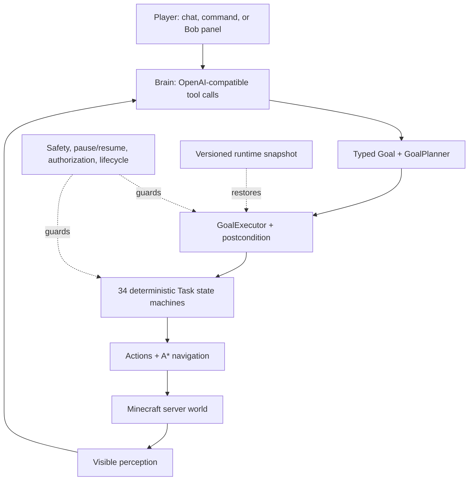

<p align="center">
  
</p>

<h1 align="center">AIBot</h1>

<p align="center">
  <b>A server-side Minecraft AI agent with LLM planning and deterministic execution.</b><br>
  Give Bob a supported goal in English or Chinese; the goal engine plans it and task state machines carry it out.<br>
  <sub><i>A Fabric mod with a real server-spawned player — not a Mineflayer account or a Python control harness.</i></sub>
</p>

<p align="center">
  <a href="LICENSE"></a>
  
  
  
  
</p>

<p align="center">
  <b>English</b>&nbsp;·&nbsp;<a href="README.zh-CN.md">简体中文</a>
</p>

---

> **The LLM chooses intent. Goals define completion. Deterministic tasks execute.**

## What AIBot is

AIBot is an open-source server-side [Fabric](https://fabricmc.net/) mod for Minecraft 1.21.3. It creates a real server-side player, accepts natural-language instructions, and maps them onto deterministic game logic for mining, crafting, smelting, building, farming, combat, fishing, trading, storage, and survival.

The model is not allowed to improvise per-tick movement or edit the world directly. It chooses from a registry of **63 tools**; the goal engine and **34 concrete Task state machines** own execution. The codebase currently contains **9 typed Goal variants**, **197 main Java classes**, and about **32K lines of main Java**.

This is an active engineering project, not a claim that every goal succeeds on every terrain. Long navigation, deep mining, large stockpiles, and full structure completion still need broader clean-commit, multi-seed evidence.

## Operating profiles

New installations default to **`strict_survival`**. The profile is resolved once at startup and is shown in structured logs and the in-game control panel together with the effective privileged capabilities.

| Profile | Behavior |
|---|---|
| `strict_survival` | Disables hidden-block scans, emergency teleports, forced pickup, and manual teleport. Resource/entity queries are filtered through nearby visibility; death returns through the normal world-spawn lifecycle, and strict mode does not force-skip the night or perform remote world mutation. |
| `operator` | Compatibility profile. Each privileged capability remains independently configurable through `operatorCapabilities`; turning one flag off is enforced even in operator mode. |

An existing legacy `aibot.json` with no top-level `profile` is loaded as `operator` once for compatibility and emits a migration warning. A missing profile on a new install defaults to strict. Invalid file or `AIBOT_PROFILE` values fail closed to `strict_survival`.

See [Operating profiles](docs/OPERATING_PROFILES.md) for the full matrix and migration rules.

## Architecture



The nine Goal variants cover item acquisition, pickaxe tiers, ore, crops, armor, workstations, stockpiles, food, and blueprint builds. Goal completion is evaluated as a typed postcondition, so a Task ending is not automatically treated as mission success.

Runtime control supports cancel/replace and nested pause/resume. Bot, mission, checkpoint, and shared-job state is written through a versioned atomic snapshot. Restart restoration reopens stale job leases instead of trusting an old process owner.

## Current verification status

The repository separates source-level checks, world-backed tests, diagnostic evidence, and release evidence:

| Layer | Current inventory / result | Meaning |
|---|---|---|
| JUnit | 19 test classes, 68 tests | Pure policy, codec, Goal predicate/result, authorization, and persistence boundaries. |
| Fabric GameTest | 3 tests | Deterministic world-backed smoke coverage in an isolated source set. |
| Runtime/profile harness | `7/7` in both strict and operator local runs | Covers capability policy plus cancel/replace/pause-resume. The currently recorded local runs came from a dirty worktree and are correctly labeled `UNVERIFIED`. |
| Restart probe | Two JVMs, `PASS` locally | Persists a non-default checkpoint, queue, pause state, and claimed Job; the second JVM proves exact restoration, stale-lease reopening, resume, and the final `COMPLETED 4/4` postcondition. |
| Real-terrain capability reports | Mixed legacy results | Historical diagnostics only unless a clean, immutable evidence bundle is explicitly pinned. They do not prove the current HEAD. |

The production mod does **not** contain `/aibot test` or `/aibot verify`. Those commands live only under `src/gametest` and are available through `runHarnessServer`, keeping test-only controls out of production jars.

See [Testing and evidence](docs/TESTING_AND_EVIDENCE.md) and the generated [capability matrix](docs/CAPABILITY_MATRIX.md).

## Quick start

### Requirements

| Component | Version |
|---|---|
| Minecraft | `1.21.3` |
| Fabric Loader | `0.18.4+` |
| Fabric API | `0.114.1+1.21.3` |
| Yarn mappings | `1.21.3+build.2` |
| Java | `21` |

### Build and run

```bash
git clone https://github.com/zoyluoblue/mc_aiplayer.git
cd mc_aiplayer

./gradlew build
./gradlew runServer
./gradlew runClient
```

### Configure the model and profile

The recommended way to provide the default DeepSeek key is an environment variable:

```bash
export DEEPSEEK_API_KEY="sk-your-key"
```

On first run, AIBot writes `aibot.json` to the Fabric config directory. A minimal explicit strict configuration is:

```json
{
  "profile": "strict_survival",
  "operatorCapabilities": {
    "hiddenBlockScan": false,
    "emergencyTeleport": false,
    "forcedPickup": false,
    "manualTeleport": false
  },
  "deepseek": {
    "baseUrl": "https://api.deepseek.com",
    "model": "deepseek-chat"
  }
}
```

Any OpenAI-compatible chat/tool-calling endpoint can be used by changing `baseUrl` and `model`. `AIBOT_PROFILE=strict_survival` or `AIBOT_PROFILE=operator` overrides the file for one process.

## Usage

```mcfunction
/aibot spawn Bob
/aibot list
/aibot brain say Bob mine 3 diamonds
/aibot task assign Bob mine minecraft:stone 16
/aibot task status Bob
/aibot brain status Bob
```

Press **`Alt + 0`** to open the Bob panel. It shows health, hunger, current work, model usage, inventory, operating profile, and effective privileged capabilities. Manual teleport controls are disabled unless `MANUAL_TELEPORT` is effective.

Commands, panel/network actions, chat routing, tools, and shared jobs pass through owner/operator authorization checks. Run AIBot only on servers where the owner has approved the selected profile and capabilities.

## Tests and evidence

```bash
./gradlew test
./gradlew runGameTest
bash scripts/persistence_restart_test.sh
```

Start the test-only interactive server when you need `/aibot test` or `/aibot verify`:

```bash
./gradlew runHarnessServer
```

Create one isolated runtime evidence bundle:

```bash
bash scripts/evidence_run.sh \
  --scenario capability_profile+runtime_control_suite \
  --profile strict_survival
```

Outputs are immutable directories under `artifacts/evidence/<run-id>/`. A dirty worktree, fixture log, unstable revision, missing actual-seed proof, or other provenance gap produces `UNVERIFIED`, even when the scenario itself passes.

```bash
bash scripts/evidence_validate.sh artifacts/evidence/<run-id>
bash scripts/evidence_validate.sh --require-verified artifacts/evidence/<run-id>
```

`reports/baselines/index.tsv` is the only selector for new `VERIFIED` capability baselines. `scripts/pin_baseline.sh` requires an explicit capability ID and run directory; it never searches for the newest or best result. The older `reports/capability_baseline_manifest.tsv` remains a capability registry and legacy fallback, whose old reports stay `UNVERIFIED`.

## Project structure

```text
src/main/java/io/github/zoyluo/aibot
├── action/        # movement, mining, interaction, inventory, building
├── brain/         # LLM requests, tools, authorization-aware dispatch
├── command/       # production /aibot commands
├── coordination/  # shared jobs and idle coordination
├── goal/          # typed goals, planner, executor, postconditions
├── mode/          # strict/operator capability policy
├── persist/       # versioned runtime snapshot and atomic storage
├── task/          # deterministic Task state machines and safety layers
└── …              # entity · mining · network · observe · pathfinding

src/gametest/      # GameTests and test-only /aibot test + /aibot verify
```

## Known limits

- Real-terrain success rates in the capability matrix are historical legacy diagnostics until replaced by pinned `VERIFIED` bundles.
- Strict mode is intentionally less forgiving: a denied privileged recovery may turn an unsafe route into a clean failure instead of teleporting the bot.
- Long-distance navigation, zero-to-diamond runs, 100-item bulk mining, and complete structure validation are not release-certified.
- LLM-backed story tests are opt-in and billed. Normal CI and nightly deterministic jobs do not receive `DEEPSEEK_API_KEY`.

See the [roadmap](ROADMAP.md) for planned reliability work.

## Contributing

Before opening a pull request:

```bash
./gradlew clean build
./gradlew runGameTest
CI_STATIC_CHECK_ARTIFACTS=1 bash scripts/ci_static_check.sh
```

When changing tests, keep verification commands in `src/gametest`. When changing a capability claim, attach an explicit evidence bundle; do not promote a legacy TSV or a dirty-worktree pass to release proof.

## License

Released under the [MIT License](LICENSE). © 2026 zoyluo.

## Acknowledgements

Built on [Fabric](https://fabricmc.net/), with natural-language reasoning through [DeepSeek](https://www.deepseek.com/) or another OpenAI-compatible provider. The server-side fake-player model follows the Carpet-mod tradition.
