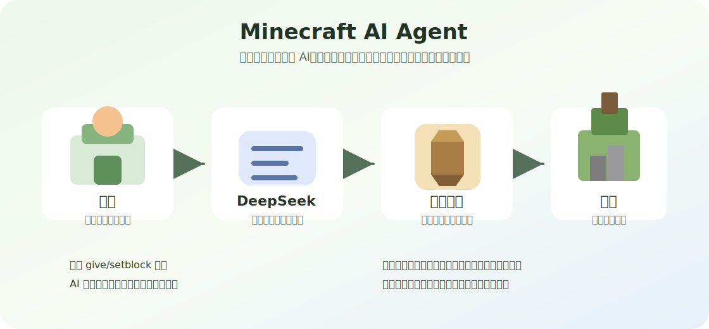
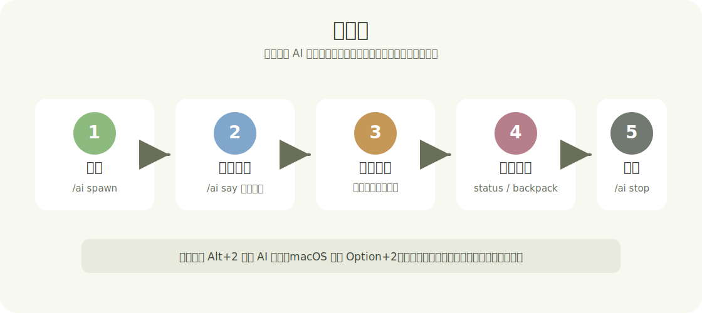
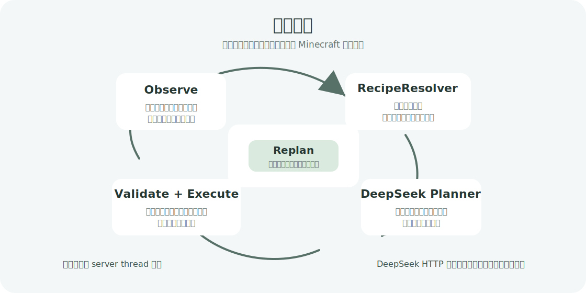

# Minecraft AI Agent for Fabric

这是一个面向 Minecraft Java Edition 的 Fabric AI Agent 项目。玩家可以用自然语言给自己的 AI 玩家下达任务，例如砍树、制作工具、挖矿、烧炼、打水和建造。项目目标不是做一个能凭空改世界的管理员工具，而是持续把 AI 玩家做成一个可信的普通生存玩家。



目标版本：

- Minecraft: `1.21.3`
- Fabric Loader: `0.18.4`
- Fabric API: `0.114.1+1.21.3`
- Java: `21`

## 这个项目是什么

AI 玩家是一个真实存在于世界里的实体，拥有自己的背包、位置、任务状态和执行队列。玩家通过 `/ai say ...` 或 AI 面板输入中文自然语言任务后，DeepSeek 负责理解意图和生成高层计划，本地模组代码负责查询 Minecraft 事实、验证计划，并用普通生存动作执行。

核心边界：

- AI 初始没有免费材料。
- AI 使用自己的真实背包，也可以按规则读取附近箱子。
- 采集、合成、熔炼、放置和打水都必须消耗真实物品。
- 破坏或放置方块前必须移动到可触及距离。
- 配方、材料数量、工具等级、箱子内容、方块存在性和路径可达性由游戏代码验证。
- DeepSeek 不负责编造物品、配方或直接修改世界。

## 如何开始

开发环境运行：

```bash
./gradlew runClient
```

打包：

```bash
./gradlew build
```

构建产物位于：

```text
build/libs/aiplayer-fabric-1.0.0.jar
```

如果要在正常客户端或服务端使用，把构建出的 jar 放入对应 Minecraft 实例的 `mods/` 目录，并安装上方版本对应的 Fabric Loader 和 Fabric API。

## 配置 DeepSeek

配置文件统一使用：

```text
config/ai.json
```

开发环境执行 `runClient` 时，会自动复制到：

```text
run/config/ai.json
```

可以参考 [config/ai.json.example](config/ai.json.example) 创建本地配置：

```json
{
  "deepseek": {
    "apiKey": "",
    "baseUrl": "https://api.deepseek.com",
    "model": "deepseek-v4-flash",
    "thinkingEnabled": false,
    "reasoningEffort": "high",
    "maxTokens": 8000,
    "temperature": 0.7
  },
  "behavior": {
    "actionTickDelay": 20,
    "enableChatResponses": true,
    "maxActiveAiPlayers": 10
  }
}
```

不要把真实 API key 写入仓库。

## 如何玩耍



先召唤自己的 AI 玩家：

```mcfunction
/ai spawn
```

也可以指定名字：

```mcfunction
/ai spawn 小助手
```

给 AI 下达自然语言任务：

```mcfunction
/ai say 去砍一棵树
```

```mcfunction
/ai say 做一个门
```

```mcfunction
/ai say 帮我做一把铁镐
```

```mcfunction
/ai say 帮我打一桶水
```

这些任务会按生存逻辑推进。比如制作铁镐时，AI 会先确认背包和附近箱子里有什么，再按需要砍树、做木板、做木棍、做工作台、做木镐、挖圆石、做石镐、找铁矿和煤、烧铁锭，最后合成铁镐。

自动挖矿入口：

```mcfunction
/ai mining start iron 3
```

上例会尝试获得 `minecraft:raw_iron x3`。常用目标包括 `coal`、`copper`、`iron`、`gold`、`diamond`、`redstone`、`lapis`、`emerald`、`obsidian`、`ancient_debris`。

查看状态：

```mcfunction
/ai status
```

查看位置：

```mcfunction
/ai location
```

查看 AI 背包：

```mcfunction
/ai backpack
```

把玩家背包里的真实物品交给 AI：

```mcfunction
/ai backpack put minecraft:oak_log 16
```

从 AI 背包取回真实物品：

```mcfunction
/ai backpack take minecraft:oak_log 16
```

停止当前任务，并让 AI 按正常导航逻辑回到玩家身边：

```mcfunction
/ai stop
```

移除自己的 AI 玩家：

```mcfunction
/ai remove
```

## AI 面板

进入游戏后按 `Alt+2` 打开 AI 面板，macOS 为 `Option+2`。

面板提供：

- 输入自然语言任务。
- 显示 AI 消息和系统消息。
- 显示背包按钮，最多展示 20 个 AI 背包格。
- 显示状态和位置。
- 显示停止按钮，触发 `/ai stop`。

面板文案以中文为主，但游戏命令子命令保持英文，例如 `spawn`、`say`、`stop`、`status`。

## 基本原理



这个模组把“AI 理解任务”和“Minecraft 生存执行”拆开：

1. Observe 观察层收集当前事实，包括 AI 背包、附近箱子、附近方块、附近实体、坐标、维度、主手工具和当前任务。
2. RecipeResolver 配方层用 Minecraft 真实配方递归计算材料链，并扣减 AI 背包和附近箱子中已经存在的材料。
3. DeepSeek Planner 只基于观察结果和配方事实生成高层计划，例如“先收集木头，再制作工作台，再合成目标物品”。
4. Plan Validator 本地验证动作白名单、物品 ID、数量、工具要求、路径和生存边界。
5. Executor 执行一个小步骤，例如移动到树旁、破坏原木、打开工作台或熔炉、放置方块。
6. Replan 每完成一步或遇到失败后重新观察，必要时让 DeepSeek 复盘下一步。

DeepSeek 请求是异步的，不能阻塞 Minecraft server thread。世界读取和世界修改必须回到 server thread 执行。

## 可调试命令

输出 AI 当前可观察状态 JSON：

```mcfunction
/ai snapshot
```

查看目标物品的递归配方链：

```mcfunction
/ai recipe minecraft:diamond_pickaxe 1
```

查看本地验证后的高层执行计划：

```mcfunction
/ai plan minecraft:oak_door 1
```

查看自动挖矿状态：

```mcfunction
/ai mining status
```

停止自动挖矿任务：

```mcfunction
/ai mining stop
```

停止挖矿并让 AI 正常走回玩家身边：

```mcfunction
/ai mining return
```

## 日志

运行日志会写入游戏目录下的 `log/` 目录。开发环境常见位置是：

```text
run/log/
```

常用分类包括：

- `planning`：自然语言任务、DeepSeek 输入输出和本地计划。
- `snapshot`：观察层导出的当前世界事实。
- `recipe`：递归配方、材料缺口和工作站需求。
- `action`：动作调度和任务队列。
- `make_item`：制作链 step、背包变化和失败原因。
- `mining`：探矿、路线、目标矿物和挖矿终止原因。
- `mining_strategy`：长任务中 DeepSeek 给出的策略建议。

排查任务时，先在 `planning.log` 找到本次命令的 `taskId`，再用同一个 `taskId` 到其他日志分类中追踪。

## 设计文档

- [AI 玩家阶段路线](docs/phases.md)
- [挖矿任务实机回归记录](docs/mining-regression.md)

