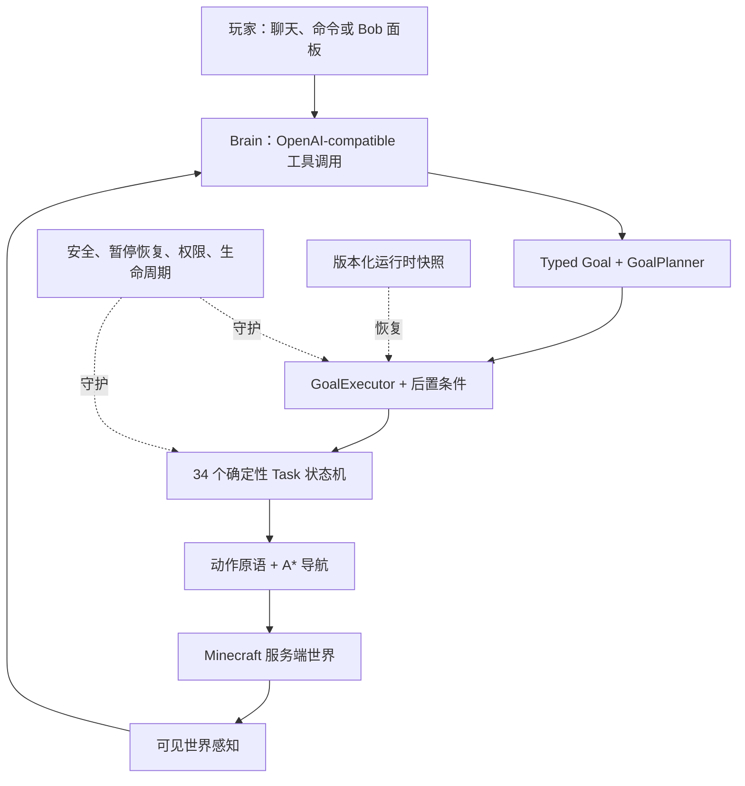

<p align="center">
  
</p>

<h1 align="center">AIBot</h1>

<p align="center">
  <b>LLM 负责规划、确定性引擎负责执行的服务端 Minecraft AI 智能体。</b><br>
  用中文或英文给 Bob 一个已支持的目标，Goal 引擎会规划步骤，Task 状态机会在游戏中执行。<br>
  <sub><i>真正的 Fabric 服务端模组与服务端玩家，不是 Mineflayer 账号，也不是 Python 控制沙盒。</i></sub>
</p>

<p align="center">
  <a href="LICENSE"></a>
  
  
  
  
</p>

<p align="center">
  <a href="README.md">English</a>&nbsp;·&nbsp;<b>简体中文</b>
</p>

---

> **LLM 选择意图，Goal 定义完成条件，确定性 Task 负责执行。**

## AIBot 是什么

AIBot 是一个面向 Minecraft 1.21.3 的开源服务端 [Fabric](https://fabricmc.net/) 模组。它会生成真实的服务端玩家，接收自然语言指令，并把指令映射到挖矿、合成、熔炼、建造、种田、战斗、钓鱼、交易、存储和生存等确定性逻辑。

大模型不能随意生成每 tick 动作，也不能绕过执行层直接改世界。它从 **63 个已注册工具**中选择意图，Goal 引擎与 **34 个具体 Task 状态机**负责执行。目前主代码包含 **9 类带类型的 Goal**、**197 个 Java 类**，约 **32K 行主 Java 代码**。

这是一个仍在持续加固的工程项目，不代表所有目标在所有地形中都能稳定完成。长距离导航、深层挖矿、大批量囤货和完整结构验收，仍需要更多绑定干净 commit 的多种子证据。

## 运行模式

新安装默认使用 **`strict_survival`**。模式在启动时解析一次，结构化日志与游戏内控制面板都会显示当前 profile 和最终生效的特权能力。

| 模式 | 行为 |
|---|---|
| `strict_survival` | 禁止隐藏方块扫描、紧急传送、强制拾取和手动传送。资源与实体查询先经过近距离可见性过滤；死亡按正常生命周期回到世界出生点；不会强制跳夜或从远处修改世界。 |
| `operator` | 兼容模式。四项特权能力仍由 `operatorCapabilities` 独立控制；即使处于 operator 模式，显式关闭的能力也会被拒绝。 |

旧版 `aibot.json` 如果完全没有顶层 `profile`，会按一次性兼容策略载入为 `operator`，并输出迁移警告。新安装缺省为 strict。配置文件或 `AIBOT_PROFILE` 中的非法值都会 fail closed 到 `strict_survival`。

完整规则见[运行模式说明](docs/OPERATING_PROFILES.md)。

## 架构



9 类 Goal 覆盖物品获取、镐等级、矿石、作物、护甲、工作站、囤货、食物和蓝图建造。Goal 是否完成由带类型的后置条件判断，Task 结束不会自动等同于任务成功。

运行时支持 cancel/replace 与嵌套 pause/resume。Bot、Mission、checkpoint 和共享 Job 状态通过版本化原子快照写入；进程重启后会重新开放旧进程留下的过期 Job lease，而不是继续信任失效的 claimant。

## 当前验证状态

项目明确区分源码级测试、世界内测试、诊断证据和发布证据：

| 层级 | 当前规模或结果 | 含义 |
|---|---|---|
| JUnit | 19 个测试类、68 个测试 | 覆盖纯策略、codec、Goal predicate/result、权限和持久化边界。 |
| Fabric GameTest | 3 个测试 | 在隔离 source set 中运行的确定性世界内 smoke test。 |
| 运行时/profile harness | strict 与 operator 本地均为 `7/7` | 覆盖 capability policy 与 cancel/replace/pause-resume。当前留存的本地 run 来自 dirty worktree，因此被正确标为 `UNVERIFIED`。 |
| 重启探针 | 两个 JVM，本地 `PASS` | 第一进程写入非默认 checkpoint、队列、pause 状态和已认领 Job；第二进程验证精确恢复、stale lease 重开、resume 及最终 `COMPLETED 4/4` 后置条件。 |
| 真实地形能力报告 | 历史结果不一 | 只有显式 pin 的干净不可变 evidence bundle 才能作为发布证据；旧报告不能证明当前 HEAD。 |

生产 Mod 中**不包含** `/aibot test` 或 `/aibot verify`。这两个命令只存在于 `src/gametest`，并通过 `runHarnessServer` 提供，避免测试控制面泄漏进生产 jar。

更多信息见[测试与证据](docs/TESTING_AND_EVIDENCE.md)和生成的[能力矩阵](docs/CAPABILITY_MATRIX.md)。

## 快速开始

### 环境要求

| 组件 | 版本 |
|---|---|
| Minecraft | `1.21.3` |
| Fabric Loader | `0.18.4+` |
| Fabric API | `0.114.1+1.21.3` |
| Yarn Mappings | `1.21.3+build.2` |
| Java | `21` |

### 构建与运行

```bash
git clone https://github.com/zoyluoblue/mc_aiplayer.git
cd mc_aiplayer

./gradlew build
./gradlew runServer
./gradlew runClient
```

### 配置模型与运行模式

推荐通过环境变量提供默认 DeepSeek API Key：

```bash
export DEEPSEEK_API_KEY="sk-your-key"
```

首次运行时，AIBot 会在 Fabric 配置目录写出 `aibot.json`。最小化的显式 strict 配置如下：

```json
{
  "profile": "strict_survival",
  "operatorCapabilities": {
    "hiddenBlockScan": false,
    "emergencyTeleport": false,
    "forcedPickup": false,
    "manualTeleport": false
  },
  "deepseek": {
    "baseUrl": "https://api.deepseek.com",
    "model": "deepseek-chat"
  }
}
```

修改 `baseUrl` 与 `model` 即可连接其他 OpenAI-compatible 对话与工具调用接口。也可以用 `AIBOT_PROFILE=strict_survival` 或 `AIBOT_PROFILE=operator` 为单个进程覆盖配置文件。

## 常用命令

```mcfunction
/aibot spawn Bob
/aibot list
/aibot brain say Bob 挖 3 颗钻石
/aibot task assign Bob mine minecraft:stone 16
/aibot task status Bob
/aibot brain status Bob
```

在游戏中按 **`Alt + 0`** 打开 Bob 控制面板。面板会展示生命、饥饿、当前任务、模型用量、背包、运行模式和最终生效的特权能力；只有 `MANUAL_TELEPORT` 生效时，手动传送控件才可用。

命令、面板/网络动作、聊天路由、工具和共享 Job 都经过 owner/operator 权限检查。请只在服主已批准当前 profile 与 capabilities 的服务器上使用。

## 测试与证据

```bash
./gradlew test
./gradlew runGameTest
bash scripts/persistence_restart_test.sh
```

需要 `/aibot test` 或 `/aibot verify` 时，启动仅用于测试的交互服务端：

```bash
./gradlew runHarnessServer
```

生成一次隔离的运行时证据：

```bash
bash scripts/evidence_run.sh \
  --scenario capability_profile+runtime_control_suite \
  --profile strict_survival
```

输出位于不可变目录 `artifacts/evidence/<run-id>/`。dirty worktree、fixture log、运行期间 revision 变化、actual seed 无法核验或其他 provenance 缺口，都会让 bundle 成为 `UNVERIFIED`，即使场景本身通过。

```bash
bash scripts/evidence_validate.sh artifacts/evidence/<run-id>
bash scripts/evidence_validate.sh --require-verified artifacts/evidence/<run-id>
```

`reports/baselines/index.tsv` 是新式 `VERIFIED` 能力基线的唯一选择器。`scripts/pin_baseline.sh` 必须显式指定 capability ID 和 run 目录，不会搜索“最新”或“最好”的报告。旧的 `reports/capability_baseline_manifest.tsv` 继续作为能力注册表与 legacy fallback，其中的旧报告始终保持 `UNVERIFIED`。

## 项目结构

```text
src/main/java/io/github/zoyluo/aibot
├── action/        # 移动、挖掘、交互、背包、建造
├── brain/         # LLM 请求、工具、带权限的调度
├── command/       # 生产环境 /aibot 命令
├── coordination/  # 共享 Job 与空闲协调
├── goal/          # typed Goal、planner、executor、后置条件
├── mode/          # strict/operator capability policy
├── persist/       # 版本化运行时快照与原子存储
├── task/          # 确定性 Task 状态机与安全层
└── …              # entity · mining · network · observe · pathfinding

src/gametest/      # GameTest 与测试专用 /aibot test、/aibot verify
```

## 已知边界

- 能力矩阵里的真实地形成功率目前属于历史 legacy 诊断，只有被新式 `VERIFIED` bundle 替换后才能作为发布证据。
- strict 模式刻意减少特权兜底：当紧急能力被拒绝时，危险路线可能以明确失败结束，而不是传送脱困。
- 长距离导航、从零挖钻、百量级挖矿和完整结构验收尚未达到 release-certified。
- LLM story 测试需要手动触发并产生 API 费用；普通 CI 和 nightly deterministic job 不会获得 `DEEPSEEK_API_KEY`。

后续规划见[路线图](ROADMAP.md)。

## 参与贡献

提交 Pull Request 前请运行：

```bash
./gradlew clean build
./gradlew runGameTest
CI_STATIC_CHECK_ARTIFACTS=1 bash scripts/ci_static_check.sh
```

新增测试控制面时，请继续放在 `src/gametest`。更新能力结论时，请附带显式 evidence bundle；不要把 legacy TSV 或 dirty-worktree PASS 提升成发布证明。

## 开源协议

基于 [MIT License](LICENSE) 发布。© 2026 zoyluo。

## 致谢

项目基于 [Fabric](https://fabricmc.net/) 构建，自然语言推理可使用 [DeepSeek](https://www.deepseek.com/) 或其他 OpenAI-compatible provider。服务端假玩家形态沿用了 Carpet mod 的传统。
