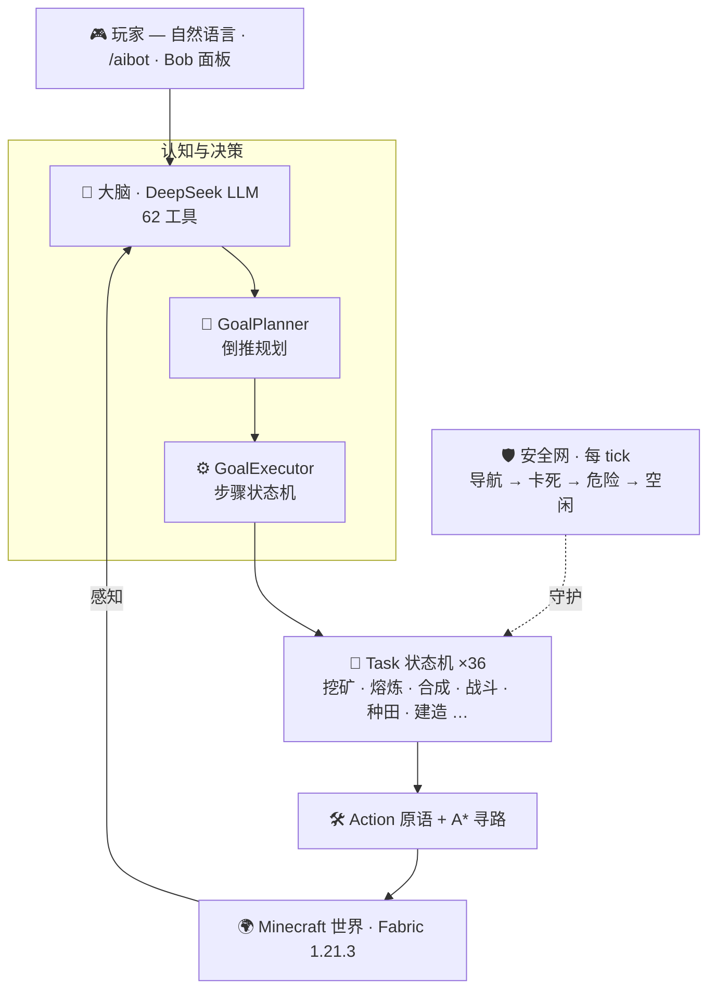

<p align="center">
  
</p>

<h1 align="center">AIBot</h1>

<p align="center">
  <b>会自己思考的 Minecraft AI 玩家。</b><br>
  你说一句,它自己想办法做到。
</p>

<p align="center">
  <a href="LICENSE"></a>
  
  
  
  
  
</p>

<p align="center">
  <a href="README.md">English</a>&nbsp;·&nbsp;<b>简体中文</b>
</p>

---

> **LLM 负责规划,Task 负责执行,Bob 负责活下来。**
>
> AIBot 会在服务端生成一个真实的玩家实体:感知世界、把你的目标倒推成完整计划、再一步步执行——挖矿、战斗、种田、自保,全程自主。

## ✨ 为什么是 AIBot

市面上的"游戏 AI"演示,要么让大模型胡乱操作、要么写死一套僵硬脚本。AIBot 两者都不是——它把"大脑"一分为二:

- 🧠 **大模型负责理解意图。** 你说"挖 3 颗钻石",DeepSeek 理解它,并从 **62 个工具**里自主选择。
- ⚙️ **确定性引擎负责可靠执行。** 倒推规划器把目标拆成依赖正确的完整计划,**36 个自包含任务状态机**稳稳执行,**五层安全网**保证 bot 不轻易送命。

最终得到一个**既能听懂大白话、又真能把活干完**的智能体。

## 🎬 实际效果

```
/aibot brain say Bob 挖 3 颗钻石
```

AIBot 把目标倒推成完整计划,逐步执行:

```
砍橡木 → 工作台 → 木镐 → 挖石头 → 石镐
→ 下到 Y16 → 挖铁 → 熔炼 → 铁镐 → 补装备
→ 台阶下到 Y-59 → ⛏  挖到钻石  ✓
```

你从不需要拆步骤。某步失败会**自动重规划**;溺水或被围攻会**及时脱身保命**。

## 🧩 核心特性

| | |
|---|---|
| 🗣️ **自然语言驱动** | 中文 / 英文直接下命令,DeepSeek 大模型 + 62 工具理解并执行。 |
| 🎯 **目标倒推规划** | 一句目标 → 依赖正确的多步计划,无需手动拆解。 |
| 🧩 **LLM + 确定性混合** | 模型负责推理,引擎负责执行。既灵活又可靠。 |
| 🎒 **9 类一句话目标** | 钻石、全套铁甲+剑、房子、基地(工作台/熔炉/箱子)、熟食、种田做面包、矿石、囤货——各一句话搞定。 |
| 🍞 **五条食物链** | 打猎→烤肉、种小麦→面包(会等作物长熟)、采浆果、无限水源灌溉、蛋糕、村庄收菜——按周围环境自动择源。 |
| 🛡️ **统一生存层** | 溺水、岩浆、窒息、卡死、威胁、困死——每 tick 自检自救;下挖竖井会封堵侧向/顶部涌水防淹。 |
| 🧍 **拟人化行为** | 台阶式斜向下挖(绝不直挖脚下)、不瞬移、不兔子跳。 |
| ⛏️ **完整生存闭环** | 挖矿、熔炼、合成、战斗、狩猎、种田、养殖、建造、钓鱼、交易、睡觉、备装。 |
| 🔭 **探矿探树** | palette 级大范围扫描定位资源,自己寻路走过去。 |
| 🌍 **真实地形验证** | 多种子可靠性测试框架(`/aibot verify`)在随机生成的世界上验证目标——不只是平整测试场。 |
| 🖥️ **客户端控制面板** | `Alt + 0` 打开 Bob 面板:生命 / 饥饿 / 任务 / token / 背包 / 聊天。 |

## 🏗️ 架构

> **一条原则:LLM 做高层规划,确定性 Task 做执行。**



<p align="center"><sub><b>164</b> 个类 · <b>30K</b> 行 · <b>62</b> 工具 · <b>36</b> 任务状态机 · <b>9</b> 类目标 · <b>5</b> 层安全网</sub></p>

## 🚀 快速开始

### 环境要求

| 组件 | 版本 |
|---|---|
| Minecraft | `1.21.3` |
| Fabric Loader | `0.18.4+` |
| Fabric API | `0.114.1+1.21.3` |
| Yarn Mappings | `1.21.3+build.2` |
| Java | `21` |

### 构建与运行

```bash
git clone https://github.com/zoyluoblue/mc_aiplayer.git
cd mc_aiplayer

./gradlew build        # 构建 Mod
./gradlew runServer    # 开发服务端
./gradlew runClient    # 开发客户端
```

### 配置大模型

推荐通过环境变量提供 DeepSeek API Key:

```bash
export DEEPSEEK_API_KEY="sk-your-key"
```

首次运行时,Mod 会在 Fabric 配置目录写出 `aibot.json`,你也可以在其中设置 key、接口地址与模型:

```json
{
  "deepseek": { "baseUrl": "https://api.deepseek.com", "model": "deepseek-chat" }
}
```

> 任何 OpenAI 兼容接口都可用——把 `baseUrl` 指向你的服务商即可。

## 🎮 常用命令

```mcfunction
/aibot spawn Bob                              # 生成一个 AI 玩家
/aibot list                                   # 查看当前 bot
/aibot brain say Bob 挖 3 颗钻石               # 自然语言目标
/aibot task assign Bob mine minecraft:stone 16
/aibot task status Bob                         # 查看 / 中止任务
/aibot brain status Bob
```

在游戏中按 **`Alt + 0`** 打开 **Bob 控制面板**——查看生命、饥饿、任务、脑区状态、token 用量与背包,并直接发送自然语言消息。

## 🧠 工作原理

| 层 | 包 | 职责 |
|---|---|---|
| **大脑** | `brain` | DeepSeek 工具调用循环;把意图翻译成目标与动作 |
| **目标引擎** | `goal` | `Goal` → `GoalPlanner`(倒推)→ `GoalExecutor`(状态机) |
| **任务** | `task` | 36 个自包含状态机,各自带看门狗 |
| **动作 / 寻路** | `action` · `pathfinding` | `BlockMiner`、`DigNav`、`ActionPack`;带可站性判定的 A* |
| **领域知识** | `craft` · `mining` | 配方、矿链 / 熔炼链、工具等级、矿物与树木探测器 |
| **安全网** | `task` · `coordination` | `BotTickCoordinator`:导航 → 卡死 → 危险 → 目标 → 空闲 |
| **实体** | `entity` | `AIPlayerEntity` —— 真实的服务端假玩家 |

## 📦 项目结构

```text
src/main/java/io/github/zoyluo/aibot
├── action/        # 低层动作:移动、挖掘、交互、背包、建造
├── brain/         # LLM 请求、工具注册、决策协调
├── command/       # /aibot 命令
├── coordination/  # 多 bot 任务板与空闲协调
├── craft/         # 配方与合成辅助
├── entity/        # AI 玩家实体
├── goal/          # 声明式目标、规划器、执行器
├── mining/        # 矿物扫描与大范围探测器
├── pathfinding/   # A* 寻路与危险检测
├── task/          # 确定性任务状态机 + 安全网
└── …              # log · memory · network · observe · persist · mixin
```

## 🛠️ 技术栈

**Java 21** · **Fabric**(Loader 0.18.4, API 0.114.1+1.21.3) · **Yarn** 1.21.3+build.2 · **Gradle** · **DeepSeek**(OpenAI 兼容接口)。

## 🗺️ 路线图

- [x] 从零目标体系 —— 食物(五条途径)、全套铁甲+剑、房子、基地、囤货
- [x] 真实地形可靠性框架 —— `/aibot verify`,多种子成功率测量
- [x] 统一生存层 —— 溺水/岩浆/火/威胁 + 尸体找回;下挖竖井封堵涌水
- [ ] 自然语言指挥加固 —— 意图→工具接线回归(`tool_dispatch`)、长距导航
- [ ] 随机地形稳定深挖钻石
- [ ] 水浇岩浆造黑曜石(≥15)
- [ ] 夜怪环境下建房真完工(工棚优先 / 白天建)
- [ ] 多 bot 协作 · 长期记忆恢复

## 🤝 参与贡献

欢迎提 Issue 和 PR!改动涉及 Minecraft / Fabric API 时请注意版本兼容——本项目锁定 **Yarn 1.21.3+build.2**。修改物品组件、进食、燃料注册、挖掘速度、熔炉库存或客户端网络代码前,先确认当前版本的方法签名。

```bash
./gradlew clean build   # 提 PR 前请确保通过
```

## 📜 开源协议

基于 [MIT 协议](LICENSE) 发布。© 2026 zoyluo。

## 🙏 致谢

基于 [Fabric](https://fabricmc.net/) 构建。自然语言推理由 [DeepSeek](https://www.deepseek.com/) 驱动。灵感来自 Carpet mod 的假玩家传统。

---

<p align="center"><sub><b>LLM plans · Tasks execute · Bob survives</b></sub></p>
